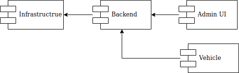
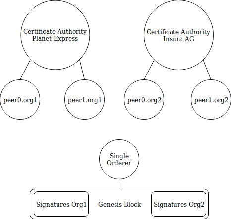
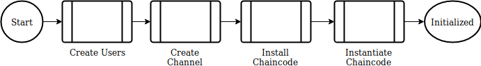
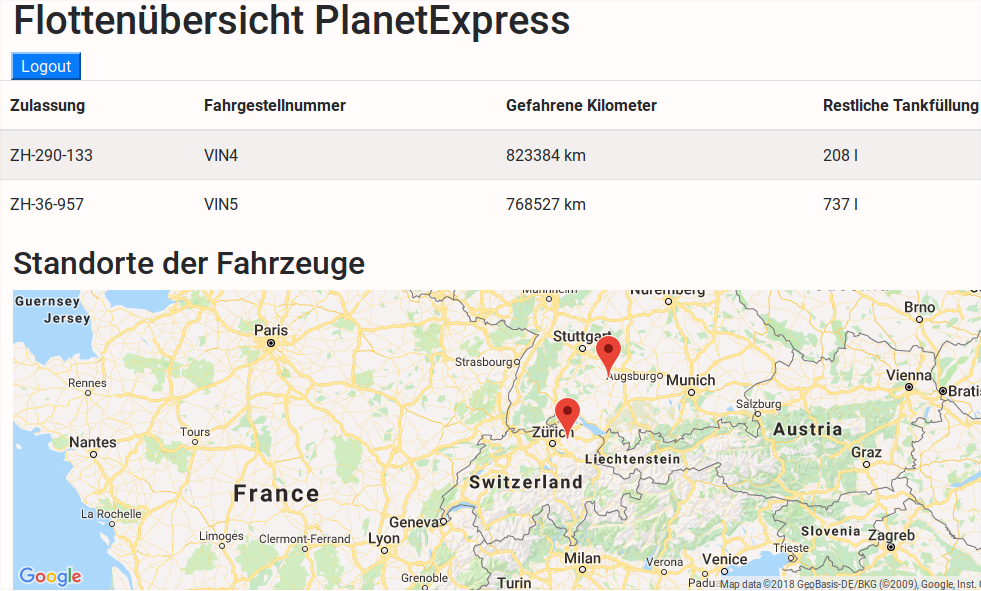
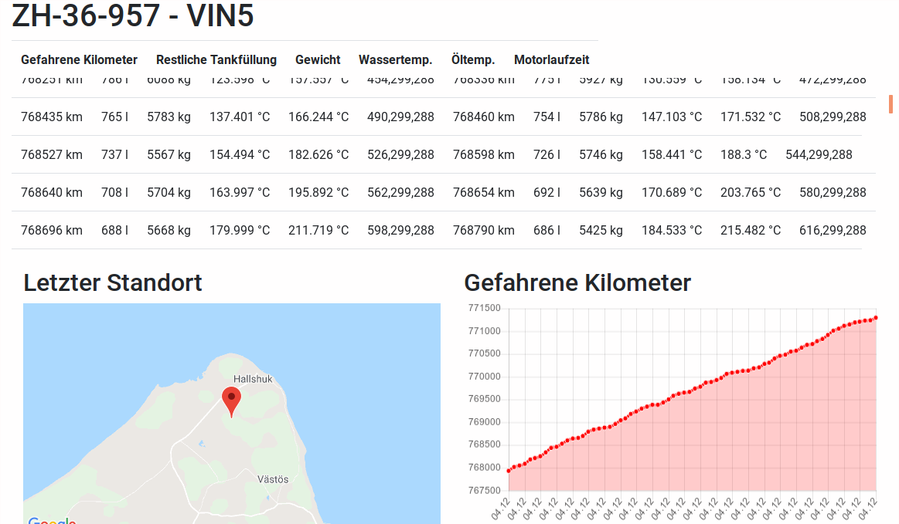

# Java and Hyperledger Fabric
@(hyperledger)
## Logistics and Insurance Showcase
As a Java developer and blockchain enthusiast, I started exploring the new possibilities which emerged in Hyperledger Fabric for creating a whole showcase completely written in Java (at least the chaincode and the backend).
I know that the technology is bleeding edge and the use case I have choosen is hypothetical. Now at the current time (December 2018), the whole crypto market is in a longterm bearmarket and google trends are not very promising. Everywhere I talk about the potential of decentralization and algorithmic trust people are quite bored about the topic.  Nevertheless the industry is constantley making progress and some very important improvements have been made or are in an advanced state (Lightning Network, Liquid, Stablecoins, Casper... ) and also Hyperledger Fabric has now released some important features

- Chaincode in Java (since 1.2)
- Java SDK 1.1
- Private Data
- Identity Mixer 

This situation is maybe a very good starting point for building up a showcase, which can give us more insights to the question 

- What business cases make sense to be implement with Hyperledger Fabric?
- How do we approach a customer  with the topic? 
- Can we get more feedback of our customers when confronting them with this showcase?

## Use Case
Imagine that there is a logistic company *PlanetExpress* which has a fleet of vehicles and there is another company *InsuraAG* which is specialized on insuring trucks.  These two companies decided to have a common database of information, which is fed from the running vehicles (location, engine details, etc). 

 For the logistic company the benefit is having a reliable, incorruptible and trusted ledger of data of their fleet and the insurance for the vehicles is calculated on a much more detailed basis. As a next step they could cooperate with other logicistic companies and track the freight going from the producer to the retailer.
 
The insurance company has access to the relevant part of the data produced by the vehicles in realtime, which they need to know in order to calculate the insurance premium for each vehicle. Having realtime data they not only can offer more accurate premiums additionally they can improve the underlaying model of premium calculation. 

We have two companies with a common trusted ledger. The logicstic company is producing (and owning) the data, which they partially share with the insurance company for better (cheeper)  calculation of the insurance premium.

## Project Modules

I started to implement this showcase using Hyperledger Fabric and its Java SDK. My approach was to divide the showcase up into four modules



**Infrastructure** - the infrastructure module provides a set of containers which represent the organisational structure and technical needed components of the whole usecase. 

**Backend** - the backend module provides a Rest API which communicates with the infrastructure. Additionally it sets up all the needed technical components like the *Channel* and the *Chaincode* when started. 

**Admin UI** - the admin UI is the user interface, where both involved companies can access their common data (what they are allowed to see of it).

**Vehicle** - the vehicle is a simple main program, which has an identification number (vin-number) and constantly sends data to the backend.   

## Infrastructure

The [Infrastructure Module](https://bitbucket.org/trivadishyperledgertruckteam/vehicletrackinginfrastructure/src/master/) contains the relevant data for running all the needed docker containers (processes), which consists of




- Two certificate authorities (one for each participating organisation)
- Each organisation needs two (for redundancy) peers where the chaincode and the ledger will reside
- A single orderer with a genesis block (this has mainly technical reasons)

The certificates are shared between the peers and the belonging certificate authority. 

Note that the infrastructure module does not contain any mention of an artifact for channel configuration. Channels are not part of the infrastructure.

## Backend

The [Backend Module](https://bitbucket.org/trivadishyperledgertruckteam/vehicletrackingbackend/src/master/) provides an interface between client programs and the infrastructure. Client programs can communicate via a Rest API to the ledger. They can insert data and query data to and from the ledger. It provides these operations

- insert a Tracking Record into the ledger
- Query a list of the latest Tracking Record of all existing vehicles
- Query the history (all Tracking Records) of a specific vehicle

When the backend module the first time starts up, it needs to go through an initialization phase, which in latter start ups can be omitted because the state is stored on the file system. After the initialization phase it reaches its operating state. 

To understand the initialization phase of the backend module we first have to introduce two new terms and concepts:  *Channel* and *Chaincode*.

### Channel

In Hyperledger Fabric a [Channel](https://hyperledger-fabric.readthedocs.io/en/release-1.3/channels.html) is a private *subnet* of communication between two or more specific network members, for the purpose of conducting private and confidential transactions. 

For me, the documentation and the tooling in Hyperledger Fabric for creating channels is a huge pain point. This is why this show case is working with the channel from integration testing of Hyperledger Fabric Java SDK.

### Chaincode
*Chaincode* is the term which is used by Hyperledger Fabric to denote a *Smart Contract*. The chaincode is a piece of software which runs on top of a channel. Only through the chaincode we have access to the ledger of the underlying channel.  

The chaincode module has a dependency to the *fabric-chaincode-shim* artifact. It must provide a class which extends *ChaincodeBase* and implements the required methods *init(ChaincodeStub stub)* and *invoke(ChaincodeStub stub)*. The first one is called only once at initialization of the chaincode, the latter is called with each invocation of the chaincode. 


### Initialization Phase



- **Create Users** - First of all the administrative users have to be created out of the generated artifacts from the infrastructure module (public and private keys). 
- **Create Channel** - In Hyperledger Fabric the basis for datastorage in any ledger is a channel. The channel has to be created using a specific tooling and later needs to be installed on all involved peers. Once the channel is created, its reference can be stored in a file on the disk and as long as the infrastructure is running that file can be used to gain access again to the channel.
-  **Install Chaincode** - The chaincode has to be installed once on the channel. After that it runs on a separate container only reachable from the peers on that channel. 
-  **Instantiate Chaincode** -  As a last step in the initialization phase of the backend, the chaincode needs to be instantiated. The instantiations purpose is to give a starting state to the ledger.


## Admin UI

The [Administrative UI](https://bitbucket.org/trivadishyperledgertruckteam/vehicletrackingadminui/src/master/) provides a reporting for the two companies

- LogisticExpress:secret
- InsuraAG:secret


Overview over the whole fleet


----------


History of single vehicle

## Vehicle

The [Vehicle](https://bitbucket.org/trivadishyperledgertruckteam/vehicletrackingvehicle/src/master/) is a Java main program, which must be started providing a vin number as runtime argument and then it simulates a running vehicle providing data to the ledger. There can be many vehicles running in parallel.
```
gradle run --args='vin123'

14:15:41.852 [main] INFO trivadis.vehicle.Vehicle - sending {
  "distance" : 835350,
  "eventTime" : "04.12.2018 01:15:41",
  "lat" : 82.29157973256747,
  "lon" : 48.350521312493086,
  "motorRunningTime" : 4897587941,
  "oilTemp" : 1595.4098051333747,
  "plateNumber" : "ZH-290-133",
  "remainingFuel" : -2317.0,
  "vin" : "VIN4",
  "waterTemp" : 1285.3700830589685,
  "weight" : 4872
}
14:15:41.859 [main] INFO trivadis.vehicle.Vehicle - response code 200
```

##Conclusion

Implementing a whole show case with Hyperledger Fabric (HF) was quite a deep dive into blockchain and the architecture of HF. There are quite some features which are not standard on a public blockchain like Ethereum or EOS such as *Private Data* and *Identity* Mixer (Zero Knowledge Proof of Identity). 
HF is quite mature when it comes to 

- Set up a small test network (two organisations and a orderer)
- Implement a smart contract (chaincode) in Java
- Generate all the public/private keys for the organisational structure

There are also usefull tools like HF Composer and different SAS solutions for the infrastructure part, but the focus of my work was, beside having the showcase, also to gain knowledger of the technical part especially implement as much as possible with Java.

It was straight forward to implement the chaincode and access the ledger through the Java SDK, but I had some difficuties to set up a Channel and access it using the SDK.  Frankly the process to set up a channel is far too cumbersome

- create a configtx.yml configuration file
- generate the artifact using configtxgen tool
- reading that artifact into the backend (SDK)
- creating the channel on the peers (using the SDK)

It should be far more easy to create a channel on selected peers. Setting up a new channel using the SDK should be an issue of some few lines of code.

Overall I think the HF is a great tool when it comes to implement a blockchain in an enterprise or setting up a new portal.


